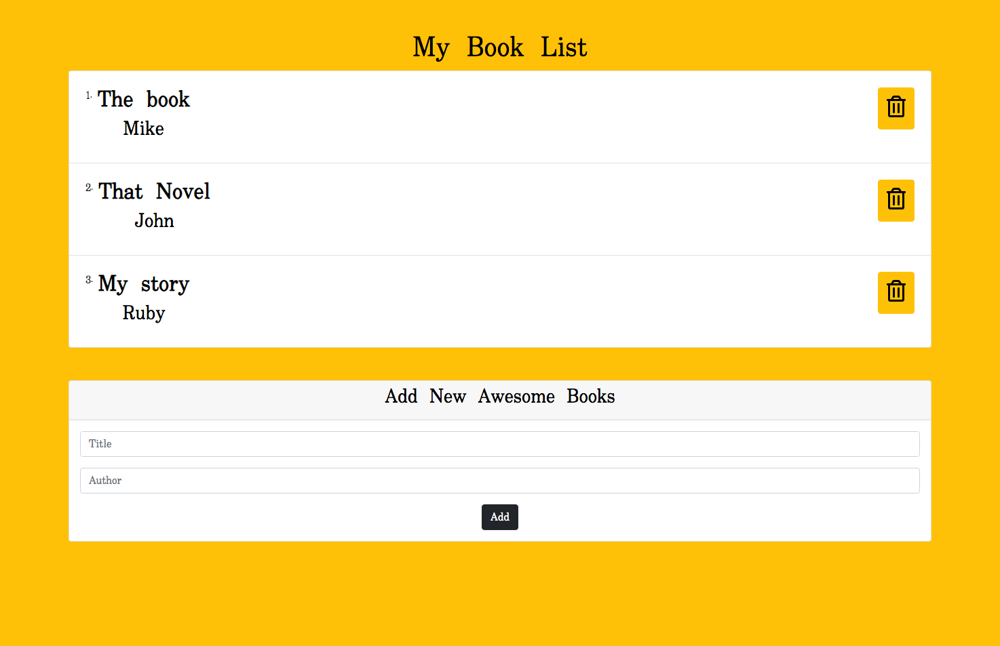

# Capstone

> Welcome to my HTML + CSS + Javascript Capstone project, feel free to look around. For this project I created a concert for developers sponsored by Microverse.

- Live version: [GitHub Page](https://smunozmo.github.io/Module_1_Capstone/)



## Built With

- HTML + CSS + Javascript

## Getting Started

* You will not need additional instructions on installing Prerequisites.
* In case you have node_modules on your folder Add them to .gitignore file before you a push.

### Prerequisites

* No prerequisites needed for this project.
 <!--
This is an example of how to list things you need to use the software and how to install them.
* npm
  ```sh
  npm install npm@latest -g
  ```
-->

### Installation
<!-- 1. Get a free API Key at [https://example.com](https://example.com) -->
1. Clone the repo
   ```sh
   git clone git@github.com:smunozmo/Module_1_Capstone.git
   ```
2. Install NPM packages
   ```sh
   npm install
   ```
<!-- 4. Enter your API in `config.js`
   ```JS
   const API_KEY = 'ENTER YOUR API';
   ```
-->

## Author

👤 **Author**

- GitHub: [@smunozmo](https://github.com/smunozmo)

## 🤝 Contributing

Contributions, issues, and feature requests are welcome!

Feel free to check the [issues page](https://github.com/smunozmo/Portfolio/issues).


## 👋 Acknowledgements

Design inspired by [Cindy Shin](https://www.behance.net/gallery/29845175/CC-Global-Summit-2015). 

## Show your support

Give a ⭐️ if you like this project!
